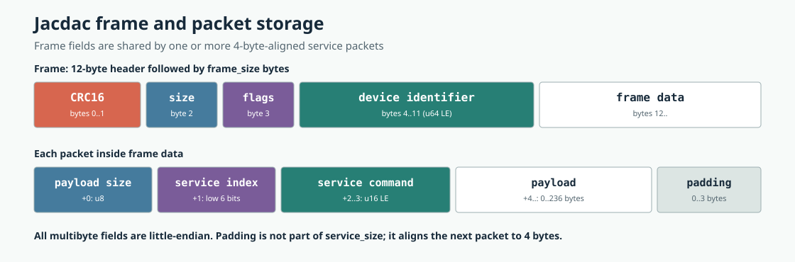
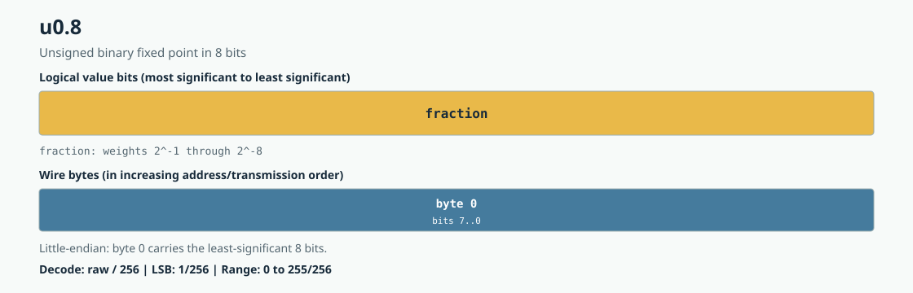
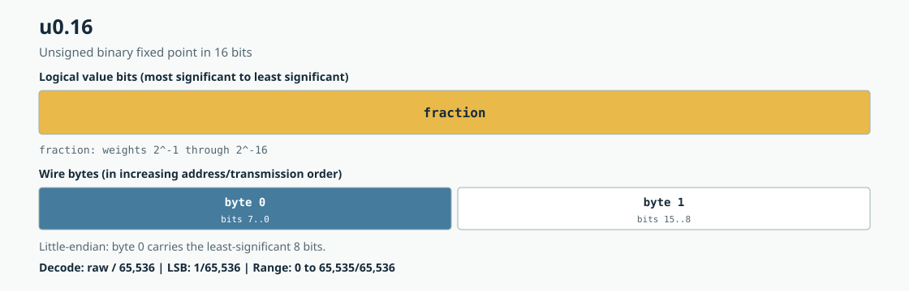
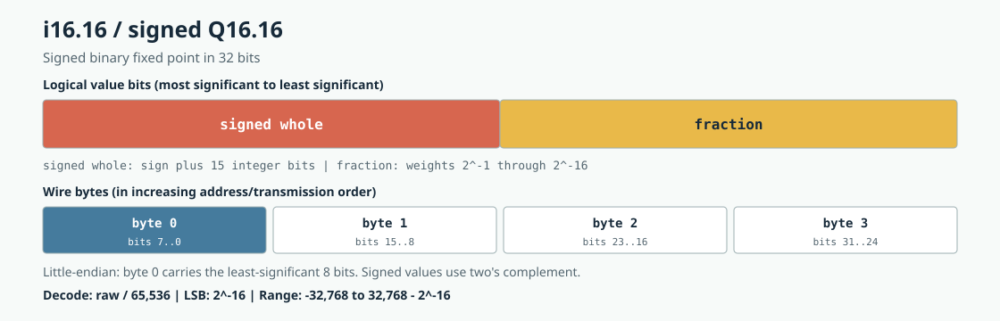
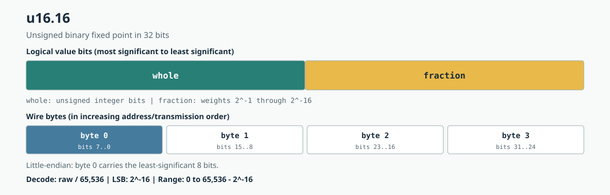

# Jacdac Arduino API

This document describes the public C++ API exported by `Jacdac.h`. All declarations are in the `jacdac` namespace.

```cpp
#include <Jacdac.h>

using namespace jacdac;
```

The global `Jacdac` object is the default `Bus` instance.

## Jacdac specification references

This library follows the public Jacdac specifications but intentionally exposes only the service clients listed in this document. These upstream references are the authority when a service-specific field, optional register, or transport rule is not repeated here:

- [Protocol specification](https://jacdac.github.io/jacdac-docs/reference/protocol/) describes frames, packets, addressing, service indexes, commands, reports, events, ACKs, CRCs, and byte order.
- [Service specification and pack format](https://jacdac.github.io/jacdac-docs/reference/service-specification/) defines register/command/event declarations and scalar, fixed-point, string, buffer, and repeated-field encodings.
- [Service catalog](https://jacdac.github.io/jacdac-docs/services/) renders the current service definitions; direct links for this library's supported services appear under [Service, register, command, and event constants](#service-register-command-and-event-constants).
- [Client/server model](https://jacdac.github.io/jacdac-docs/reference/clientserver/) explains the role of service clients and servers.
- [Single-wire serial](https://jacdac.github.io/jacdac-docs/reference/single-wire-serial/) and the [electrical specification](https://jacdac.github.io/jacdac-docs/reference/electrical-spec/) cover the physical bus beneath this API.
- The machine-readable source catalog lives in [`microsoft/jacdac`](https://github.com/microsoft/jacdac/tree/main/services). This library's constants are a maintained subset, not a replacement for those definitions.

## Installation and target setup

Install Sandeep Mistry's nRF5 Arduino core (validated with 0.8.0), select BBC micro:bit or BBC micro:bit V2, and select SoftDevice **None**:

```powershell
arduino-cli core update-index --additional-urls https://sandeepmistry.github.io/arduino-nRF5/package_nRF5_boards_index.json
arduino-cli core install sandeepmistry:nRF5 --additional-urls https://sandeepmistry.github.io/arduino-nRF5/package_nRF5_boards_index.json
```

Install the named `Jacdac-X.Y.Z.zip` release asset using **Sketch > Include Library > Add .ZIP Library**. It contains the library source, documentation, and all examples, including `HardwareValidation`. The named ZIP excludes build output and tests; GitHub's automatic source archives are not the minimal Arduino library package.

The default data connection is micro:bit `P12` to `JD_DATA`, with common ground and an appropriately rated Jacdac power source on `JD_PWR`. Do not power actuator chains directly from the micro:bit 3 V pin. Verify adapter switch position and supply ratings before use.

| Target | Resources owned by transport | Default device slots |
| --- | --- | ---: |
| V1 (`NRF51`, nRF51822) | P12, UART0, TIMER2 | 16 |
| V2 (`NRF52833_XXAA`) | P12, UARTE1, TIMER3 | 32 |

V1 has only one hardware UART. Do not reference `Serial` in a V1 Jacdac sketch: doing so conflicts with the transport's UART0 handler. The individual serial examples and hardware bench target V2. V1-safe examples are `MicrobitV1`, `PeripheralKitV1`, and `ProtocolFeaturesV1`.

```powershell
arduino-cli compile --fqbn sandeepmistry:nRF5:BBCmicrobitV2:softdevice=none --library . examples\V2\Others\Discover
arduino-cli compile --fqbn sandeepmistry:nRF5:BBCmicrobit:softdevice=none --library . examples\V1\MicrobitV1
```

### First sketch

```cpp
#include <Jacdac.h>

void setup() {
    jacdac::Jacdac.begin();
}

void loop() {
    jacdac::Jacdac.process();
}
```

Do not block `loop()` or callbacks for long periods. Use `millis()` deadlines for polling, and call `process()` between long serial output sections. A false queue result is backpressure or a validation error, not proof that the hardware is absent.

## Bus lifecycle

```cpp
Bus::Bus();
Bus::~Bus();
bool Bus::begin(uint8_t pin = 12);
void Bus::end();
void Bus::process();
bool Bus::running() const;
```

- `Bus` is non-copyable. Only one `Bus` can own the singleton nRF transport at a time; use the global `Jacdac` instance unless tests or application structure require a different instance.
- `begin()` initializes the transport, resets devices, queues, pending operations, and diagnostics, and starts controller announcements. It returns `false` when the target or pin is unsupported. Calling it on a running bus succeeds without reinitializing it.
- `end()` stops the transport so another `Bus` can start. Destroying an active `Bus` also stops it.
- `process()` dispatches received packets and callbacks, manages ACK retries and asynchronous-register timeouts, expires disconnected devices, sends periodic announcements, and advances outgoing traffic. Call it frequently from `loop()`.
- `running()` reports whether initialization succeeded and the bus has not been stopped.

Callbacks registered on `Bus` run synchronously from `process()`, not from an interrupt.

### Operation errors

```cpp
enum class Error : uint8_t {
    None,
    NotRunning,
    TransportUnavailable,
    InvalidArgument,
    InvalidService,
    PacketTooLarge,
    QueueFull,
    NoCapacity,
    DuplicateRequest,
    InvalidSubscription
};

Error Bus::lastError() const;
```

Each synchronous operation that can fail sets `lastError()`. A successful operation clears it to `Error::None`; inspect it immediately after a `false` or `INVALID_SUBSCRIPTION` result. It does not report later asynchronous outcomes: ACK timeouts use `acknowledged == false`, register timeouts pass `nullptr`, and remote command errors use `CommandErrorHandler`.

```cpp
void setup() {
    Jacdac.begin(12);
}

void loop() {
    Jacdac.process();
}
```

## Devices and services

### `Device`

```cpp
struct Device {
    uint64_t deviceIdentifier;
    uint8_t serviceCount;
    uint32_t serviceClasses[MAX_SERVICES_PER_DEVICE];

    bool connected() const;
};
```

`deviceIdentifier` is the Jacdac device identifier. Service index 0 is the control service; `serviceClasses[0]` describes service index 1. Timing, announcement, report, restart, and event-sequencing state is private to `Bus`.

A `Device` reference or pointer addresses internal bus storage. Do not retain it across later calls to `process()`; copy required values instead.

### `Service`

```cpp
struct Service {
    uint64_t deviceIdentifier;
    uint32_t serviceClass;
    uint8_t serviceIndex;

    bool valid() const;
};
```

A `Service` is a lightweight snapshot. Resolve it again after disconnects or device restarts. An invalid service has a zero `deviceIdentifier`.

### Discovery

```cpp
uint8_t Bus::deviceCount() const;
const Device *Bus::device(uint8_t index) const;
Service Bus::findService(uint32_t serviceClass, uint8_t instance = 0) const;
Service Bus::service(uint64_t deviceIdentifier, uint8_t serviceIndex) const;
Service Bus::resolve(const ServiceBinding &binding) const;
```

- `deviceCount()` returns the number of currently connected devices.
- `device(index)` returns the connected device at the zero-based discovery index, or `nullptr`.
- `findService()` returns the zero-based matching instance across connected devices.
- `service()` resolves a device and service index. Index 0 resolves the control service.
- `resolve()` resolves a `ServiceBinding`.

```cpp
Service temperature = Jacdac.findService(service::TEMPERATURE);
if (temperature.valid()) {
    Jacdac.getRegister(temperature, reg::READING);
}
```

### Stable bindings

```cpp
struct ServiceBinding {
    explicit ServiceBinding(uint32_t serviceClass = 0, uint8_t instance = 0);
    bool bound() const;
    void bind(const Service &service);
    void clear();
};
```

An unbound binding resolves by class and instance. After `bind()`, it resolves only the same device and service index. `clear()` returns it to class-and-instance resolution.

```cpp
ServiceBinding role(service::BUTTON, 1);
role.bind(Jacdac.resolve(role));
Service sameButton = Jacdac.resolve(role);
```

## Packets

```cpp
struct PacketView {
    uint64_t deviceIdentifier;
    const uint8_t *data;
    uint16_t serviceCommand;
    uint8_t serviceIndex;
    uint8_t dataSize;
    uint8_t flags;

    bool isCommand() const;
    bool isReport() const;
    bool isRegisterGet() const;
    bool isEvent() const;
    uint16_t registerCode() const;
    uint16_t eventCode() const;
    uint8_t eventCounter() const;
};
```

`PacketView` is a parsed, native C++ view rather than a packed object that should be cast over received memory. On the wire, a frame starts with a 12-byte shared header. Every contained packet then starts with a four-byte service header and is padded to a four-byte boundary; the padding is not included in `dataSize`.



`data` remains valid only for the duration of the packet callback. Use `readValue()` for aligned native-value extraction:

```cpp
uint32_t reading;
if (packet.isRegisterGet() && packet.registerCode() == reg::READING && readValue(packet, reading)) {
    // use reading
}
```

Register reports use the same `CMD_GET_REGISTER | register` command code as register requests. Events are reports on regular services whose command carries an event code and seven-bit sequence counter. Reserved-service ACKs carry a CRC in that field and are not events or command-error reports.

## Commands and registers

```cpp
bool Bus::sendCommand(
    const Service &service,
    uint16_t command,
    const void *data = nullptr,
    uint8_t size = 0,
    bool requestAck = false);
bool Bus::getRegister(const Service &service, uint16_t reg);
bool Bus::setRegister(
    const Service &service,
    uint16_t reg,
    const void *data,
    uint8_t size,
    bool requestAck = false);
template <typename T>
bool Bus::setRegister(
    const Service &service,
    uint16_t reg,
    const T &value,
    bool requestAck = false);
```

These methods return whether the request was validated and queued. `false` can indicate a stopped bus, invalid service, oversized packet, full transmit queue, unavailable ACK slot, or duplicate pending ACK request. A successful return does not by itself confirm remote execution.

When `requestAck` is true, the bus makes up to four transmission attempts. Completion is reported through an ACK callback.

```cpp
uint16_t value = 42;
Jacdac.setRegister(target, reg::VALUE, value, true);
```

### Asynchronous register reads

```cpp
using RegisterResponseHandler = void (*)(const PacketView *packet, void *context);

bool Bus::getRegisterAsync(
    const Service &service,
    uint16_t reg,
    RegisterResponseHandler handler,
    void *context = nullptr,
    uint32_t timeoutMs = 1000);
```

The callback receives the matching report or `nullptr` on timeout. The method rejects invalid services, null handlers, a full request table, and duplicate requests for the same device, service, and register.

```cpp
void readingReceived(const PacketView *packet, void *) {
    if (packet == nullptr) {
        return;
    }
    uint16_t value;
    if (readValue(*packet, value)) {
        // use value
    }
}

Jacdac.getRegisterAsync(target, reg::READING, readingReceived);
```

### Multicast

```cpp
bool Bus::sendMulticast(
    uint32_t serviceClass,
    uint16_t command,
    const void *data = nullptr,
    uint8_t size = 0);
```

Queues one broadcast command addressed to every service of the specified nonzero class. Multicast does not request ACKs.

### Command batches

```cpp
class CommandBatch {
public:
    explicit CommandBatch(uint64_t deviceIdentifier, bool requestAck = false);
    bool add(
        const Service &service,
        uint16_t command,
        const void *data = nullptr,
        uint8_t size = 0);
    template <typename T>
    bool add(const Service &service, uint16_t command, const T &value);
    uint8_t packetCount() const;
    Error error() const;
};

bool Bus::sendBatch(const CommandBatch &batch);
```

All services in a batch must belong to the constructor's device. `add()` returns `false` for an invalid or different-device service, invalid payload, or insufficient frame space; `error()` gives the reason. `sendBatch()` rejects an empty batch and copies its error to `Bus::lastError()` when applicable.

```cpp
CommandBatch batch(button.deviceIdentifier, true);
batch.add(button, CMD_GET_REGISTER | reg::BUTTON_ANALOG);
batch.add(button, CMD_GET_REGISTER | reg::READING);
Jacdac.sendBatch(batch);
```

## Control service

```cpp
bool Bus::identify(uint64_t deviceIdentifier, bool requestAck = false);
bool Bus::resetDevice(uint64_t deviceIdentifier, bool requestAck = false);
bool Bus::standby(uint64_t deviceIdentifier, uint32_t durationMs, bool requestAck = false);
bool Bus::setStatusLight(
    uint64_t deviceIdentifier,
    uint8_t red,
    uint8_t green,
    uint8_t blue,
    uint8_t speed = 0);
bool Bus::requestDeviceDescription(uint64_t deviceIdentifier);
bool Bus::requestProductIdentifier(uint64_t deviceIdentifier);
bool Bus::requestFirmwareVersion(uint64_t deviceIdentifier);
bool Bus::requestUptime(uint64_t deviceIdentifier);
```

These helpers address service index 0 on the specified device.

## Callbacks and subscriptions

```cpp
using PacketHandler = void (*)(const PacketView &, void *context);
using DeviceHandler = void (*)(const Device &, DeviceEvent, void *context);
using AckHandler = void (*)(
    uint64_t deviceIdentifier,
    uint16_t packetCrc,
    bool acknowledged,
    void *context);
using CommandErrorHandler = void (*)(
    const Service &,
    uint16_t serviceCommand,
    uint16_t packetCrc,
    void *context);
uint8_t Bus::addPacketHandler(
    PacketHandler handler,
    void *context = nullptr,
    uint64_t deviceIdentifier = 0,
    uint8_t serviceIndex = 0xff,
    uint16_t serviceCommand = 0xffff);
uint8_t Bus::addDeviceHandler(DeviceHandler handler, void *context = nullptr);
uint8_t Bus::addAckHandler(AckHandler handler, void *context = nullptr);

bool Bus::removePacketHandler(uint8_t subscription);
bool Bus::removeDeviceHandler(uint8_t subscription);
bool Bus::removeAckHandler(uint8_t subscription);
void Bus::setCommandErrorHandler(CommandErrorHandler handler, void *context = nullptr);
```

All observers use fixed-capacity subscriptions. `addPacketHandler()` supports optional filters: zero matches every device, `0xff` every service index, and `0xffff` every service command. Add methods return `INVALID_SUBSCRIPTION` (`0xff`) when the handler is null or no slot remains. Remove methods return `false` for an invalid or inactive handle.

`DeviceEvent` values are `Connected`, `Disconnected`, `Restarted`, and `ReportsMissed`. An ACK callback receives `acknowledged == false` after all attempts time out. `setCommandErrorHandler()` installs the single replaceable handler for remote `command_not_implemented` reports; passing `nullptr` disables it.

## Typed clients

Typed clients derive from `ServiceClient`. They resolve their zero-based service instance once and then retain a stable binding to that physical device. A disconnect makes the client unresolved instead of silently switching it to another matching device; call `clearBinding()` to select the current instance again.

### `ServiceClient`

```cpp
ServiceClient(Bus &bus, uint32_t serviceClass, uint8_t instance = 0);
bool connected() const;
Service resolve() const;
bool bind(const Service &service);
void clearBinding();
```

`resolve()` creates the stable binding on its first successful lookup. `bind()` accepts only a valid service of the client's configured class and reports `Error::InvalidService` otherwise. Command methods return `false` when the bound service is disconnected or the request cannot be queued.

### `SensorClient`

```cpp
SensorClient(Bus &bus, uint32_t serviceClass, uint8_t instance = 0);
bool requestReading() const;
bool setStreaming(uint8_t samples = 255) const;
bool setStreamingInterval(uint32_t milliseconds) const;
bool setReadingRange(uint32_t range) const;
bool setInactiveThreshold(int32_t threshold) const;
bool setActiveThreshold(int32_t threshold) const;
bool calibrate(bool requestAck = false) const;
bool requestStatus() const;
bool requestPreferredStreamingInterval() const;
bool requestReadingResolution() const;
bool requestInstanceName() const;
bool matchesReading(const PacketView &packet) const;
```

`setStreaming()` writes the requested sample count. For continuous streaming, conventionally refresh `255` before it reaches zero.

### `ActuatorClient`

```cpp
ActuatorClient(Bus &bus, uint32_t serviceClass, uint8_t instance = 0);
bool requestStatus() const;
bool requestInstanceName() const;
```

`ActuatorClient` contains only operations whose wire format is uniform across actuator services. Use a service-specific client or `Bus::setRegister()` with the exact specification type for intensity and value registers.

### `ButtonClient`

```cpp
explicit ButtonClient(Bus &bus, uint8_t instance = 0);
bool requestPressure() const;
bool requestPressed() const;
bool requestAnalog() const;
bool readPressed(const PacketView &packet, bool &pressed) const;
```

Pressure is the standard `READING` register (`uint16_t`, [`u0.16`](docs/type-layouts/u0-16.svg)). `pressed` (`0x181`) is a client-only derived value, not a mandatory wire register. `requestPressed()` is retained as a compatibility helper but now requests pressure; handle the resulting `0x1101` report using `readPressed()` rather than expecting a one-byte `0x1181` reply. `readPressed()` updates the caller's boolean from matching pressure reports or down/up/hold events; initialize that boolean to false and clear it on disconnect. It returns false without modifying the value for unrelated or truncated packets. Analog capability is an optional `uint8_t` register. Button-down events carry no payload; button-up and hold events may carry a `uint32_t` duration in milliseconds.

### `RotaryEncoderClient`

```cpp
explicit RotaryEncoderClient(Bus &bus, uint8_t instance = 0);
bool requestPosition() const;
bool requestClicksPerTurn() const;
bool requestClicker() const;
Service buttonService() const;
```

Position is `int32_t`; clicks per turn is `uint16_t`. `buttonService()` returns the immediately following button service when the encoder advertises one.

### `PotentiometerClient`

```cpp
explicit PotentiometerClient(Bus &bus, uint8_t instance = 0);
bool requestPosition() const;
bool requestVariant() const;
```

Position is a `uint16_t` [`u0.16`](docs/type-layouts/u0-16.svg) ratio. Variants are defined by `PotentiometerVariant`.

### Light, magnetic field, acceleration, and distance clients

These clients inherit `SensorClient`, including stable instance binding, `requestReading()`, streaming configuration, and `matchesReading()`.

| Client constructor | Additional queries | Reading payload |
| --- | --- | --- |
| `LightLevelClient(Bus &, uint8_t instance = 0)` | `requestLightLevel()`, `requestVariant()` | `uint16_t` [`u0.16`](docs/type-layouts/u0-16.svg) light-level ratio |
| `MagneticFieldLevelClient(Bus &, uint8_t instance = 0)` | `requestStrength()`, `requestVariant()` | `int16_t` [`i1.15`](docs/type-layouts/i1-15.svg) strength; divide by 32768 |
| `AccelerometerClient(Bus &, uint8_t instance = 0)` | `requestForces()` | Three `int32_t` [`i12.20`](docs/type-layouts/i12-20.svg) values in X/Y/Z order; divide each by 1048576 for g |
| `DistanceClient(Bus &, uint8_t instance = 0)` | `requestDistance()`, `requestVariant()` | `uint32_t` [`u16.16`](docs/type-layouts/u16-16.svg) metres; divide by 65536 |

The queries return `bool` for queueing success and deliver reports through the bus packet handlers, like the other clients. Ultrasonic sensors use the `DISTANCE` service, not a separate service class; its optional variant register identifies ultrasonic as 1. Light level is a ratio, not a calibrated measurement in physical units. For accelerometer reports, `readValue(packet, forces)` accepts an `int32_t forces[3]` array and rejects truncated payloads. The [XYZ payload diagram](docs/type-layouts/acceleration-xyz.svg) shows the three independent little-endian values.

### Environmental clients

`TemperatureClient(Bus &, uint8_t instance = 0)` provides `requestTemperature()` and `requestVariant()`. `HumidityClient(Bus &, uint8_t instance = 0)` provides `requestHumidity()`. Both inherit `SensorClient` and deliver register reports through the bus handlers.

Temperature is a signed `int32_t` [`i22.10`](docs/type-layouts/i22-10.svg) value; divide by 1024 for degrees Celsius. Humidity is an unsigned `uint32_t` [`u22.10`](docs/type-layouts/u22-10.svg) value; divide by 1024 for relative humidity in percent, not a 0-1 ratio. An environmental module can expose both services under one device identifier. Use explicit service binding when pairing them on a bus with several environmental modules.

### `LedStripClient`

```cpp
explicit LedStripClient(Bus &bus, uint8_t instance = 0);
bool setBrightness(uint8_t brightness, bool requestAck = false) const;
bool setNumPixels(uint16_t numPixels, bool requestAck = false) const;
bool setMaxPower(uint16_t milliamps, bool requestAck = false) const;
bool setNumRepeats(uint16_t repeats, bool requestAck = false) const;
bool requestActualBrightness() const;
bool requestNumPixels() const;
bool requestMaxPixels() const;
bool requestVariant() const;
bool runProgram(const uint8_t *program, uint8_t size, bool requestAck = false) const;
bool setAll(uint8_t red, uint8_t green, uint8_t blue, bool requestAck = false) const;
bool setPixel(
    uint16_t pixel,
    uint8_t red,
    uint8_t green,
    uint8_t blue,
    bool requestAck = false) const;
```

Brightness uses `uint8_t` [`u0.8`](docs/type-layouts/u0-8.svg); RGB operands are red, green, blue in that exact byte order. `setPixel()` accepts indexes through 16383. Variants and light types are defined by `LedStripVariant` and `LedStripLightType`.

### `LedClient`

```cpp
explicit LedClient(Bus &bus, uint8_t instance = 0);
bool setBrightness(uint8_t brightness, bool requestAck = false) const;
bool setPixels(const uint8_t *rgb, uint8_t byteCount, bool requestAck = false) const;
bool requestPixels() const;
bool requestNumPixels() const;
bool requestVariant() const;
bool requestActualBrightness() const;
```

`setPixels()` sends [packed RGB bytes](docs/type-layouts/rgb.svg) to the `VALUE` register. Each pixel occupies three bytes with no native-structure padding. `requestPixels()` reads the same bytes; `requestNumPixels()` reads `uint16_t` register `0x182`, `requestVariant()` reads the optional shape byte, and `requestActualBrightness()` reads `uint8_t` register `0x180`. A physical ring or short strip may use this `LED` service rather than the separate `LED_STRIP` program service. Bind according to its announced service class, not the product's shape or name.

### `ServoClient`

```cpp
explicit ServoClient(Bus &bus, uint8_t instance = 0);
bool setAngle(float angleDegrees, bool requestAck = false) const;
bool setAngleQ16(int32_t angleDegreesQ16, bool requestAck = false) const;
bool setEnabled(bool enabled, bool requestAck = false) const;
bool requestAngle() const;
bool requestEnabled() const;
bool requestMinAngle() const;
bool requestMaxAngle() const;
bool requestActualAngle() const;
```

`setAngle()` accepts degrees directly and converts them to the [signed `i16.16` wire layout](docs/type-layouts/float-to-i16-16.svg). `setAngleQ16()` exposes that representation directly for code that already uses fixed-point values. `setEnabled()` writes actuator intensity 1 or 0 as a one-byte boolean.

`requestAngle()` reads the commanded target (`VALUE`); it does not measure motor position. `requestEnabled()` reads a `uint8_t` boolean (`INTENSITY`). Minimum and maximum angles use `MIN_VALUE` (`0x110`) and `MAX_VALUE` (`0x111`). All angle replies are signed `int32_t` Q16.16 degrees. `requestActualAngle()` reads the optional `READING` register and may be unsupported on controllers without position feedback.

Read the advertised limits before moving a motor; the client does not automatically query or clamp to them. Set the initial target while disabled, then enable power; disable power at the end. Multiple outputs on one controller are separate services: `ServoClient(bus, 0)` and `ServoClient(bus, 1)` select the first and second servo instances, or use `bind()` to select a specific device and service index.

A continuous-rotation servo interprets the controller's pulse width as direction and speed rather than an absolute angle. Its neutral setting depends on the motor/calibration; the controller's angle register does not identify the attached motor type.

### Peripheral actuator clients

The following clients encode service-specific payload widths:

| Client | Main operations and wire units |
| --- | --- |
| `RelayClient` | `setActive(bool)`, `requestActive()` (one-byte state), variant and maximum-current requests |
| `VibrationMotorClient` | `vibrate(const VibrationStep *, uint8_t)`, `stop()`, maximum-sequence request |

`VibrationStep::duration8Milliseconds` is measured in 8 ms units; `intensity` is [`u0.8`](docs/type-layouts/u0-8.svg). The command payload is a [repeated two-byte sequence](docs/type-layouts/vibration-sequence.svg), not an array of pointers or a count followed by records.

For haptic output, use `VibrationMotorClient`. `vibrate(steps, count, requestAck)` sends a finite sequence of duration/intensity pairs; `stop(requestAck)` sends the specified empty sequence to cancel vibration. A step `{25, 128}` requests 200 ms at roughly half intensity. `requestMaxVibrations()` reads the optional one-byte maximum sequence length at `0x180`; some devices reject that register but still support vibration and stop commands. ACKs confirm command receipt, not measured motor motion, and retransmission can restart a pulse.

### PowerClient

```cpp
explicit PowerClient(Bus &bus, uint8_t instance = 0);
bool setAllowed(bool allowed, bool requestAck = false) const;
bool setMaxPower(uint16_t milliamps, bool requestAck = false) const;
bool setKeepOnPulse(
    uint16_t durationMilliseconds,
    uint16_t periodMilliseconds,
    bool requestAck = false) const;
bool requestAllowed() const;
bool requestMaxPower() const;
bool requestCurrentDraw() const;
bool requestBatteryVoltage() const;
bool requestPowerStatus() const;
bool requestBatteryCharge() const;
bool requestBatteryCapacity() const;
bool requestKeepOnPulseDuration() const;
bool requestKeepOnPulsePeriod() const;
```

| Register | Code | Payload | Access |
| --- | --- | --- | --- |
| Allowed | `0x001` | `uint8_t` bool | Read/write |
| Maximum current (`max_power`) | `0x007` | `uint16_t` mA | Optional; may be read-only |
| Current draw | `0x101` | `uint16_t` mA | Optional read |
| Input/battery voltage | `0x180` | `uint16_t` mV | Optional read |
| Power status | `0x181` | `uint8_t` `PowerStatus` | Read and change event |
| Battery charge | `0x182` | `uint16_t` [`u0.16`](docs/type-layouts/u0-16.svg) ratio | Optional read |
| Battery capacity | `0x183` | `uint32_t` mWh | Optional read |
| Keep-on pulse duration | `0x080` | `uint16_t` ms | Optional read/write |
| Keep-on pulse period | `0x081` | `uint16_t` ms | Optional read/write |

`PowerStatus` defines `Disallowed=0`, `Powering=1`, `Overload=2`, and `Overprovision=3`. `event::VALUE_CHANGED` on a power service carries the new status byte. `allowed=1` permits power delivery but does not guarantee it; inspect status. Disabling a channel can cut power to peripherals but normally does not remove the provider's own announced identity.

`setKeepOnPulse()` rejects a zero period or duty cycle above 10%. It queues one ordered batch: duration zero, new period, then new duration. This avoids intentionally applying a new duration against an old period, but the remote device may not support the registers or frame batching. Always read the values back. Keep-alive pulses deliberately draw current; use only when the supply requires them. Current-limit writes cannot increase the hardware rating and may be ignored or clamped. Power-provider shutdown negotiation is automatic and is not exposed as a normal directed helper.

**Verified read-only on 2026-09-16:** both `D5DEDD2A07564AAB` and `565585F86091A379` report allowed 1, status `Powering`, and limit 900 mA. Both explicitly reject current draw, input voltage, battery charge/capacity, and keep-on duration/period. Their ability to change the current limit was not tested. No power settings were changed. Generic Control-service metadata can be queried separately and is firmware-dependent. A multi-port supply may announce separate device identities for each channel, even if only one port is connected.

## Wire values and storage layouts

Jacdac pack types are byte-oriented. All multibyte numbers are transmitted little-endian: byte 0 contains the least-significant eight bits, regardless of whether the logical value is signed, unsigned, or fixed-point. Signed integers use two's-complement representation. These rules come from the upstream [pack format](https://jacdac.github.io/jacdac-docs/reference/service-specification/#pack-format).

The diagrams show logical fields from most-significant to least-significant at the top, then actual byte order in memory and on the wire. Do not cast a payload pointer to a multibyte C++ type: `readValue()` uses `memcpy`, avoids alignment faults, and checks that enough payload bytes are present.

### Scalar and API-only types

| C++ API spelling | Jacdac storage | Width | Typical use here | Layout |
| --- | --- | ---: | --- | --- |
| `uint8_t` | `u8` | 1 byte | Counts, flags, variants, intensity, RGB channels | [SVG](docs/type-layouts/uint8.svg) |
| `uint16_t` | `u16` | 2 bytes | Register/command codes, CRC, durations, current, pixel counts | [SVG](docs/type-layouts/uint16.svg) |
| `int16_t` | `i16` | 2 bytes | Signed magnetic-field raw storage | [SVG](docs/type-layouts/int16.svg) |
| `uint32_t` | `u32` | 4 bytes | Service classes, milliseconds, capacities, unsigned readings | [SVG](docs/type-layouts/uint32.svg) |
| `int32_t` | `i32` | 4 bytes | Signed readings and signed fixed-point storage | [SVG](docs/type-layouts/int32.svg) |
| `uint64_t` | protocol identifier | 8 bytes | Device identifiers shared by every packet in a frame | [SVG](docs/type-layouts/uint64.svg) |
| `bool` | typed clients encode `u8` | 1 byte | Allowed/enabled/active state | [SVG](docs/type-layouts/bool-u8.svg) |
| `enum class ... : uint8_t` | `u8` enum code | 1 byte | Variants, light type, power status | [SVG](docs/type-layouts/enum-u8.svg) |
| `const uint8_t *`, `const void *` plus size | `bytes` | 0-236 bytes | Opaque command/register payloads and LED programs | [SVG](docs/type-layouts/bytes.svg) |
| `float` accepted by `setAngle()` | converted to `int32_t` `i16.16` | 4 wire bytes | Ergonomic servo angle input | [SVG](docs/type-layouts/float-to-i16-16.svg) |

`size_t`, pointers, references, callback function types, templates, `PacketView`, `Device`, and `Service` are native C++ API constructs. Their host-memory size is target-dependent and they are never serialized as objects. A pointer argument identifies bytes for the library to copy; the pointer address itself never goes onto the bus.

### Fixed-point notation

For `uA.B` and `iA.B`, `B` is the number of fractional bits and the storage width is `A + B` bits. The `i` form is signed two's complement, and its `A` count includes the sign bit. If `raw` is the signed or unsigned integer loaded from the payload, the exact represented number is:

$$
value = raw / 2^B
$$

| Format | C++ raw storage | Scale | Exact range | Resolution | Layout |
| --- | --- | ---: | --- | --- | --- |
| `u0.8` | `uint8_t` | $2^8$ | $0$ to $1 - 2^{-8}$ | $2^{-8}$ | [SVG](docs/type-layouts/u0-8.svg) |
| `u0.16` | `uint16_t` | $2^{16}$ | $0$ to $1 - 2^{-16}$ | $2^{-16}$ | [SVG](docs/type-layouts/u0-16.svg) |
| `i1.15` | `int16_t` | $2^{15}$ | $-1$ to $1 - 2^{-15}$ | $2^{-15}$ | [SVG](docs/type-layouts/i1-15.svg) |
| `i12.20` | `int32_t` | $2^{20}$ | $-2^{11}$ to $2^{11} - 2^{-20}$ | $2^{-20}$ | [SVG](docs/type-layouts/i12-20.svg) |
| `i22.10` | `int32_t` | $2^{10}$ | $-2^{21}$ to $2^{21} - 2^{-10}$ | $2^{-10}$ | [SVG](docs/type-layouts/i22-10.svg) |
| `u22.10` | `uint32_t` | $2^{10}$ | $0$ to $2^{22} - 2^{-10}$ | $2^{-10}$ | [SVG](docs/type-layouts/u22-10.svg) |
| `i16.16` / signed Q16.16 | `int32_t` | $2^{16}$ | $-2^{15}$ to $2^{15} - 2^{-16}$ | $2^{-16}$ | [SVG](docs/type-layouts/i16-16.svg) |
| `u16.16` | `uint32_t` | $2^{16}$ | $0$ to $2^{16} - 2^{-16}$ | $2^{-16}$ | [SVG](docs/type-layouts/u16-16.svg) |

#### `u0.8` and `u0.16` ratios

These types have no whole-number bits. `u0.8` raw `0x80` represents exactly $0.5$, while `0xff` represents $255/256$, not exactly 1. Likewise, `u0.16` raw `0x8000` is $0.5$, while `0xffff` is $65535/65536$.





There are two useful but different conversions. Divide by `256` or `65536` to recover the exact Jacdac fixed-point number. For a user-facing percentage, dividing by `255` or `65535` deliberately maps the largest representable raw value to exactly 100%. `uq16ToFloat()` and the percentage-oriented examples use this second, full-scale normalization; it should not be mistaken for the binary fixed-point equation above.

#### Signed and unsigned 16.16

Both 16.16 forms occupy four bytes. In signed `i16.16`, the high 16 bits contain the sign and whole-number portion; in `u16.16`, all high 16 bits are unsigned. The low 16 bits are fractional in both cases.





For example, `1.5` encodes as raw `0x00018000` and wire bytes `00 80 01 00`. A servo angle of `-10.0` uses signed raw `0xfff60000` and wire bytes `00 00 f6 ff`. Byte order changes where the bytes are stored, not the logical location of the fractional field.

#### Sensor fixed-point formats

- `i1.15` is a compact bipolar ratio. Raw `-16384` (`0xc000`, bytes `00 c0`) represents `-0.5`.
- `i12.20` gives accelerometer axes a wide signed range and fine resolution. Raw `0x00100000` (bytes `00 00 10 00`) represents exactly `1 g`.
- `i22.10` and `u22.10` reserve ten fractional bits. Temperature `23.5` encodes as signed raw `24064` (`0x00005e00`); humidity `48.25` encodes as unsigned raw `49408` (`0x0000c100`).

Their complete bit and byte layouts are available as [`i1.15`](docs/type-layouts/i1-15.svg), [`i12.20`](docs/type-layouts/i12-20.svg), [`i22.10`](docs/type-layouts/i22-10.svg), and [`u22.10`](docs/type-layouts/u22-10.svg) SVGs.

### Composite payloads

Some service values are sequences rather than single scalars. Their fields are packed in specification order, while each multibyte field remains little-endian:

- [Accelerometer XYZ](docs/type-layouts/acceleration-xyz.svg): three four-byte `i12.20` values, for a 12-byte payload.
- [Packed RGB](docs/type-layouts/rgb.svg): red, green, and blue as adjacent `u8` bytes.
- [Vibration sequence](docs/type-layouts/vibration-sequence.svg): repeated `{ duration: u8, intensity: u0.8 }` tuples; an empty payload stops the motor.
- [Variable byte buffer](docs/type-layouts/bytes.svg): bytes are copied in order, with the packet's `dataSize` carrying the length.

### Conversion helpers

```cpp
template <typename T>
bool readValue(const PacketView &packet, T &value);

float q10ToFloat(int32_t value);
float uq16ToFloat(uint16_t value);
int32_t floatToQ16(float value);
```

`q10ToFloat()` performs exact signed `i22.10` scaling by 1024. Unsigned `u22.10` values use the same divisor after being read into `uint32_t`. `uq16ToFloat()` performs full-scale ratio normalization by 65535 so the maximum raw value becomes `1.0f`. `floatToQ16()` multiplies by 65536 and truncates toward zero when converting the result to `int32_t`; callers must keep the input within the signed 16.16 range.

Common conversions, with the intended interpretation made explicit:

| Format | Exact fixed-point conversion | Full-scale UI conversion |
| --- | --- | --- |
| signed `i22.10` | `int32_t / 1024.0f` | Same |
| unsigned `u22.10` | `uint32_t / 1024.0f` | Same |
| signed `i16.16` | `int32_t / 65536.0f` | Same |
| unsigned `u16.16` | `uint32_t / 65536.0f` | Same |
| ratio `u0.16` | `uint16_t / 65536.0f` | `uint16_t / 65535.0f` |
| ratio `u0.8` | `uint8_t / 256.0f` | `uint8_t / 255.0f` |

`readValue()` copies exactly `sizeof(T)` bytes with `memcpy` and returns `false` when the payload is too short. For arrays such as `int32_t forces[3]`, it copies the entire array and therefore requires all 12 bytes. It does not rescale fixed-point data or reject extra trailing payload bytes.

## Diagnostics

```cpp
const Diagnostics &Bus::diagnostics() const;
```

Counters reset on `begin()`.

| Field | Meaning |
| --- | --- |
| `framesReceived`, `framesSent` | Valid frames processed and frames transmitted |
| `crcErrors` | Frames rejected by protocol validation |
| `receiveOverflows`, `transmitOverflows` | Full receive or transmit queues |
| `malformedPackets` | Structurally or semantically incomplete packets inside valid frames |
| `deviceOverflows` | Announced devices rejected because the device table is full |
| `busErrors` | Aggregate physical receive errors |
| `collisions` | Arbitration attempts that found the line occupied |
| `acksReceived`, `ackRetries`, `ackTimeouts` | ACK lifecycle counters |
| `duplicateEvents`, `outOfOrderEvents` | Events suppressed by the device-global sequence counter |
| `deviceRestarts`, `missedReports` | Conditions detected from announcements |
| `registerTimeouts` | Asynchronous register requests that expired |
| `commandErrors` | Remote `command_not_implemented` reports |
| `fallingEdges`, `receiveStarts`, `receiveCompletions` | Physical receive progression |
| `receiveBytes` | Total bytes finalized by the receiver |
| `receiveTimeouts`, `receiveShortFrames` | Timed-out or truncated receives |
| `receiveInvalidFrames` | Complete-looking frames rejected by validation |
| `receiveHardwareErrors` | UART/UARTE hardware-error terminations of invalid frames; valid end-of-frame breaks are excluded |

Transport counters are synchronized into `Diagnostics` by `process()`.

## Service, register, command, and event constants

Service classes are defined under `jacdac::service` in `JacdacServices.h`. The public named service set is restricted to the following hardware-verified types plus Control. Generic packet and discovery APIs remain protocol-level building blocks, not claims of additional device support.

| Service constant | Identifier | Upstream specification |
| --- | --- | --- |
| `CONTROL` | `0x00000000` | [Control](https://jacdac.github.io/jacdac-docs/services/control/) |
| `ACCELEROMETER` | `0x1f140409` | [Accelerometer](https://jacdac.github.io/jacdac-docs/services/accelerometer/) |
| `BUTTON` | `0x1473a263` | [Button](https://jacdac.github.io/jacdac-docs/services/button/) |
| `DISTANCE` | `0x141a6b8a` | [Distance](https://jacdac.github.io/jacdac-docs/services/distance/) |
| `HUMIDITY` | `0x16c810b8` | [Humidity](https://jacdac.github.io/jacdac-docs/services/humidity/) |
| `LED` | `0x1609d4f0` | [LED](https://jacdac.github.io/jacdac-docs/services/led/) |
| `LED_STRIP` | `0x126f00e0` | [LED strip](https://jacdac.github.io/jacdac-docs/services/ledstrip/) |
| `LIGHT_LEVEL` | `0x17dc9a1c` | [Light level](https://jacdac.github.io/jacdac-docs/services/lightlevel/) |
| `MAGNETIC_FIELD_LEVEL` | `0x12fe180f` | [Magnetic field level](https://jacdac.github.io/jacdac-docs/services/magneticfieldlevel/) |
| `POTENTIOMETER` | `0x1f274746` | [Potentiometer](https://jacdac.github.io/jacdac-docs/services/potentiometer/) |
| `POWER` | `0x1fa4c95a` | [Power](https://jacdac.github.io/jacdac-docs/services/power/) |
| `RELAY` | `0x183fe656` | [Relay](https://jacdac.github.io/jacdac-docs/services/relay/) |
| `ROTARY_ENCODER` | `0x10fa29c9` | [Rotary encoder](https://jacdac.github.io/jacdac-docs/services/rotaryencoder/) |
| `SERVO` | `0x12fc9103` | [Servo](https://jacdac.github.io/jacdac-docs/services/servo/) |
| `TEMPERATURE` | `0x1421bac7` | [Temperature](https://jacdac.github.io/jacdac-docs/services/temperature/) |
| `VIBRATION_MOTOR` | `0x183fc4a2` | [Vibration motor](https://jacdac.github.io/jacdac-docs/services/vibrationmotor/) |

Common register and event contracts inherited by these services are defined by the upstream [base service](https://jacdac.github.io/jacdac-docs/services/_base/), [sensor mixin](https://jacdac.github.io/jacdac-docs/services/_sensor/), and [system constants](https://jacdac.github.io/jacdac-docs/services/_system/).

Core protocol constants:

| Constant | Value |
| --- | ---: |
| `CMD_ANNOUNCE` | `0x0000` |
| `CMD_EVENT` | `0x0001` |
| `CMD_CALIBRATE` | `0x0002` |
| `CMD_COMMAND_NOT_IMPLEMENTED` | `0x0003` |
| `CMD_GET_REGISTER` | `0x1000` |
| `CMD_SET_REGISTER` | `0x2000` |
| `SERVICE_INDEX_CONTROL` | `0x00` |
| `SERVICE_INDEX_MAX_REGULAR` | `0x3a` |
| `SERVICE_INDEX_BROADCAST` | `0x3d` |
| `SERVICE_INDEX_PIPE` | `0x3e` |
| `SERVICE_INDEX_CRC_ACK` | `0x3f` |

Common events under `jacdac::event` are `ACTIVE`/`BUTTON_DOWN` (`0x01`), `INACTIVE`/`BUTTON_UP` (`0x02`), `VALUE_CHANGED` (`0x03`), and `BUTTON_HOLD` (`0x81`).

Public variants:

| Type | Values |
| --- | --- |
| `LedStripLightType` | `Ws2812bGrb = 0x00`, `Apa102 = 0x10`, `Sk9822 = 0x11` |
| `LedStripVariant` | `Strip = 0x01`, `Ring = 0x02`, `Stick = 0x03`, `Jewel = 0x04`, `Matrix = 0x05` |
| `PotentiometerVariant` | `Slider = 0x01`, `Rotary = 0x02`, `Hall = 0x03` |
| `PowerStatus` | `Disallowed = 0`, `Powering = 1`, `Overload = 2`, `Overprovision = 3` |

Register constants are under `jacdac::reg`; service command constants are under `jacdac::command`. Use `JacdacServices.h` for the included register and command values and the generated Jacdac specification headers as the authority for complete service-specific payload layouts.

## Low-level frame API

Most applications should use `Bus`. The following API is available for frame tooling and protocol tests:

```cpp
uint16_t crc16(const void *data, size_t size);
size_t frameSize(const Frame &frame);
bool validateFrame(const Frame &frame, size_t receivedSize);
void resetFrame(Frame &frame, uint64_t deviceIdentifier, uint8_t flags);
bool appendPacket(
    Frame &frame,
    uint8_t serviceIndex,
    uint16_t serviceCommand,
    const void *data = nullptr,
    uint8_t dataSize = 0);
void finalizeFrame(Frame &frame);
bool packetAt(const Frame &frame, size_t &offset, PacketView &packet);
```

`Frame` and `PacketHeader` are packed wire structures. `appendPacket()` returns `false` when the packet does not fit. `packetAt()` advances `offset` while iterating packets and returns `false` when no valid packet remains.

## Compile-time configuration

Apply overrides consistently to all library and sketch translation units, for example with project-wide compiler flags. A definition in only the sketch does not configure the separately compiled library files.

| Macro | Default | Valid range |
| --- | ---: | --- |
| `JACDAC_MAX_DEVICES` | 32 (V2), 16 (V1), 8 (other/host) | 1-254 |
| `JACDAC_MAX_SERVICES_PER_DEVICE` | 16 | 1-58 |
| `JACDAC_RX_QUEUE_SIZE` | 4 | 1-254 |
| `JACDAC_TX_QUEUE_SIZE` | 4 | 1-254 |
| `JACDAC_MAX_ACK_REQUESTS` | 4 | 1-254 |
| `JACDAC_MAX_REGISTER_REQUESTS` | 4 | 1-254 |
| `JACDAC_MAX_SUBSCRIBERS` | 6 | 1-254 |
| `JACDAC_FRAME_DATA_SIZE` | 240 | Multiple of 4 from 8 through 240 |

The device-capacity defaults are selected by `NRF52833_XXAA` (V2) and `NRF51` (V1); an explicit `JACDAC_MAX_DEVICES` definition takes precedence. Power-provider device identities occupy slots just like peripherals. Queue and request capacities are independent of the device-table size.

The default maximum frame data is 240 bytes, of which 236 bytes are available as serial payload after frame overhead. Increasing capacities increases static RAM use. With the default 16 services per device, each device-table slot uses 88 bytes on the micro:bit targets.

## Implementation

The library is a fixed-memory controller/client, not a Jacdac peripheral/server. `JacdacProtocol` owns wire layout, CRC and packet iteration; `JacdacTransport` owns the nRF GPIO/UART/timer state machine; `Jacdac` owns queues, discovery, ACKs and subscriptions; `JacdacClients` supplies service-specific helpers; `JacdacServices` and `JacdacConfig` supply constants and capacity settings.

### Interrupts and ownership

Transport interrupts do bounded hardware work and invoke private bus callbacks. Received validated frames are copied into the RX ring; transmit completion advances the TX ring. User callbacks execute only when `Bus::process()` drains frames. The transport is a singleton, with one active owning `Bus`; a second bus cannot stop the owner. Queue indices are volatile and frame copies use short interrupt-disabled sections. Application code should not operate transport registers directly.

On V2, the 250 us receive-header check reads the frame-size byte written by EasyDMA, not the in-progress `RXD.AMOUNT` register. Completion waits for receive stop before validating length and CRC. Jacdac's trailing break raises UART framing/break events, so a valid frame terminated by that delimiter is not counted as a hardware fault.

The Arduino GPIOTE channel is detached while transmitting so GPIO can drive the start/end pulses, then restored for receive. Short waits use the transport timer where needed; UARTE shutdown waits boundedly for `TXSTOPPED`. These are hardware-sensitive behaviors: target builds and live interoperability checks are required for changes. The software handles packet loss; it is not a full waveform-conformance certification.

### Memory and lifetime

The library allocates no heap memory. Device records, frame queues, ACK requests, register requests, and subscriptions are fixed-capacity arrays. Frame rings contain one extra slot to distinguish full from empty. A capacity failure is explicit via `lastError()` or diagnostics; there is no allocation fallback. `Device` references address mutable bus table slots; `PacketView::data` addresses the current RX frame. Copy values that must survive a callback or later `process()` call.

The optional V2 bench has additional fixed probe/output storage independent of `Bus`. It holds up to `min(4 * MAX_DEVICES, 254)` register probes, reports probe overflow, and does not imply that every possible service on 32 devices can be probed at once. Power-channel probes have different byte widths; absent optional registers are marked unsupported, not reported as a measured zero. Disconnected probe histories are labeled separately from the live device table.

### Delivery and failure contracts

Queue success is not remote execution. ACKs identify a frame by device and CRC; the CRC in an ACK is not a service command or event. Retries can repeat non-idempotent operations such as a vibration pulse. Register responses have no request token, so only one identical request may be pending. Timeouts pass `nullptr`; device-side rejections are separately delivered to the command-error handler. Unsupported-register replies do not cancel the pending generic read immediately; callers must tolerate its subsequent timeout callback.

V1 uses a per-byte UART interrupt and remains more timing-sensitive than V2. Its physical interoperability remains unverified. All retained peripheral service types have V2 hardware evidence described in README and host-fixture coverage; optional registers and configuration operations remain hardware-dependent. The library does not certify every product variant implementing those types.

### Tests and releases

Host checks use C++11 with `-DJACDAC_TEST -Itests -Isrc -Wall -Wextra -Wpedantic`, linking `JacdacProtocol.cpp`, `Jacdac.cpp`, `JacdacClients.cpp`, `mock_arduino.cpp`, and `mock_transport.cpp` against each test main. `test_protocol` checks wire parsing; `test_bus` checks clients, queues, ACKs and capacity; `test_hardware_validation` includes the real bench with a serial stub and checks decoding, output ordering, retries, limits, and shutdown. CI compiles representative V1/V2 examples and the V2 bench. The release workflow builds all individual examples for V2 and the three V1-safe examples for V1.

To publish a release, update `library.properties`, commit and push, then create a matching stable `vX.Y.Z` tag and push that tag. The release workflow checks that the tag matches the library version and creates the minimal library ZIP. An ordinary commit/push does not create a release tag.
