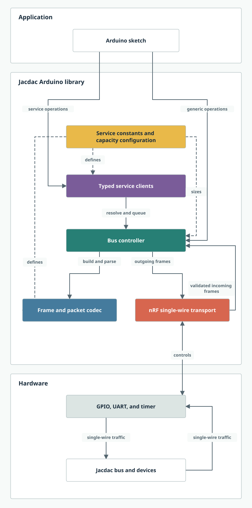

# Architecture

This diagram provides a high-level view of the library. Detailed implementation and ownership documentation remains in [API.md](API.md#implementation), alongside the public programming reference.

